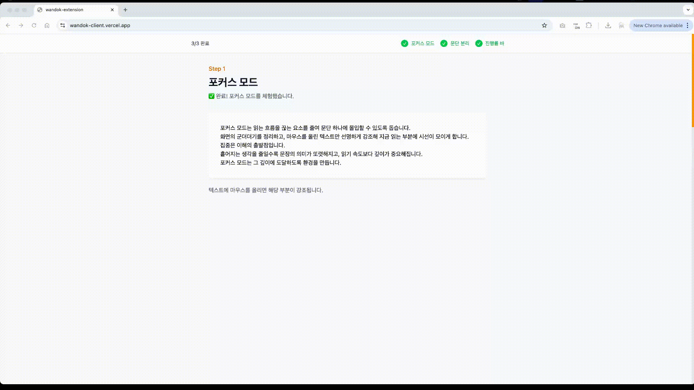
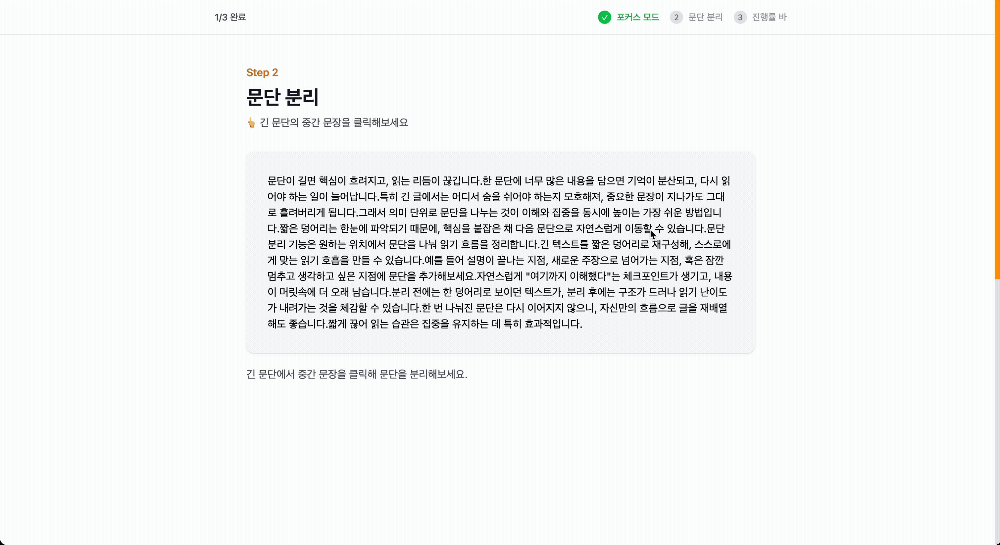
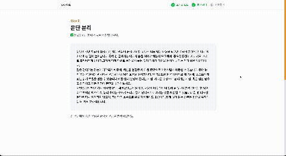
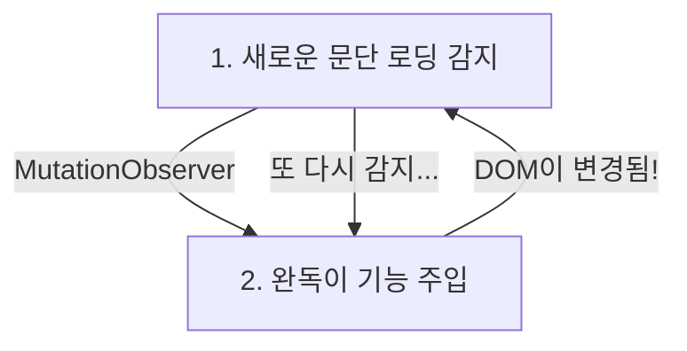
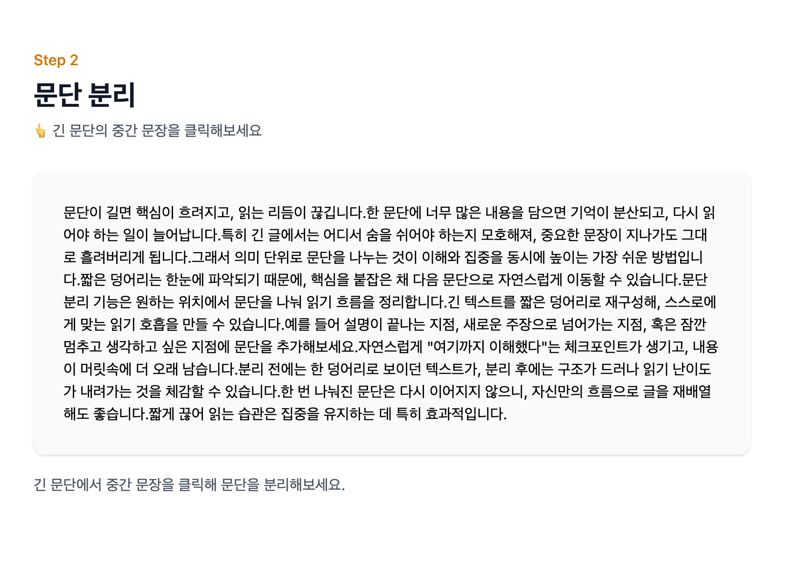
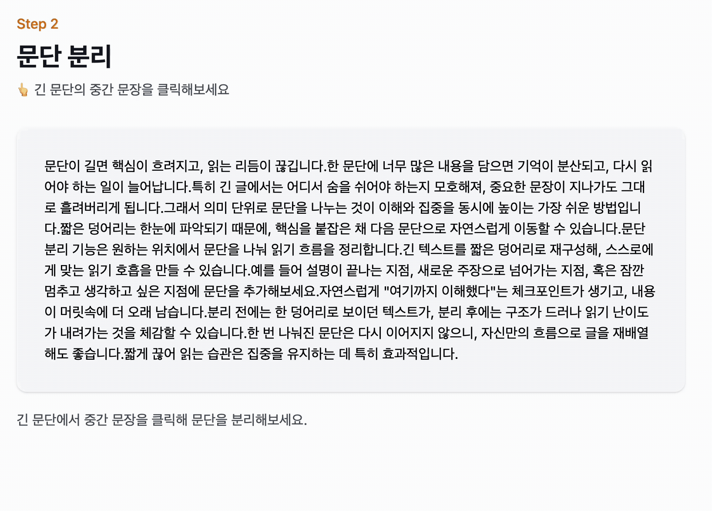

<div align="center">

# 완독이 (Wandok)


[완독이 체험해보기](https://wandok-client.vercel.app/)

<br>

공식 문서의 긴 설명, 문단 분리 없는 테크 블로그의 글 등, 우리는 수많은 '줄글'들을 마주칩니다.

화면 가득 텍스트가 채워진 화면을 마주쳤을 때, 부담을 느낀 적 없으셨나요?

<br>

완독이는 **브라우저의 읽기 경험 향상**을 위해 등장했습니다.

<br>

> 현재 읽고 있는 문단만을 강조하며 **시각적 집중**을 유도하고, <br>
> 긴 문단을 클릭 한 번으로 **분리**하죠. <br>
> 진행률 바를 통해 **현재 진행 상황**을 확인하여, 읽기 흐름을 조절할 수 있도록 합니다.

</div>

<br>
<br>
<br>

# Features

## 포커스 모드

>_"집중과 단순함... 거기에 도달하면 산도 움직일 수 있다."_<br>
 _— Steve Jobs_



문단 위에 마우스를 올리면, 해당 문단을 제외한 나머지 문장은 블러 처리가 됩니다.

마우스를 올린 텍스트만 선명하게 강조하여 지금 읽는 부분에 시선이 모이게 합니다.

<br>

*수많은 글들 속에서, 내가 읽고 있는 부분에만 집중해보세요.*

<br>

## 문단 분리
>_"문제의 크기에 압도당한다면, 더 작은 조각으로 나눠라."_<br>
  _— Chuck Close_



문단이 길면 핵심이 흐려지고, 읽는 리듬이 끊깁니다.

긴 문단 속의 문장을 클릭해보세요.

완독이는 클릭한 문장을 새로운 문단으로 나누어, 읽기 흐름을 정리합니다.

<br>

*문단을 나누어 자신만의 흐름으로 글을 재배열해보세요.*

<br>

## 진행률 바

>_"얼마나 남았는지보다, 얼마나 왔는지에 집중하라."_<br>
  _— Heidi Johnson_



한 페이지 안에 긴 글이 빽빽하게 작성되어 있는 경우, 한 번에 글을 다 읽기란 쉽지 않습니다.

현재까지 읽은 양을 진행률 바를 통해 확인해보세요.

브라우저 스크롤바는 '페이지 위치'를 알려주지만,

진행률 바는 '성취감'을 보여줍니다.


<br>

*채워지는 진행률 바는 작은 성취감을 만들고, 그 성취감이 완독을 유도합니다.*

---
<br>

# 🛠️ 트러블 슈팅: DOM 조작과 무한 루프 탈출기

완독이는 사용자가 문장을 클릭했을 때 문단을 나누어야 합니다.

이를 위해 외부 웹페이지의 DOM을 직접 조작해야 했고, 이 과정에서 두 가지 큰 기술적 난관에 부딪혔습니다.

<br>

## 1️⃣ 첫 번째 시도: Shadow DOM을 이용한 스타일 격리

기존 웹페이지 위에 새로운 UI를 요소를 추가하는 완독이의 특성 상, 기존 웹페이지의 CSS가 깨지는 **스타일 오염(Style Pollution)** 문제가 발생했습니다.

이를 해결하기 위해 스타일이 캡슐화된 **Shadow DOM** 도입을 시도했습니다.

<br>

#### ⛔️ 발생한 문제:

읽기 전용 UI에는 적합했지만, 본문 텍스트를 조작해야 하는 완독이의 특성상 치명적인 문제가 발생했습니다.

- **이벤트 버블링 차단**: 클릭/호버 이벤트가 Shadow Root 경계에서 끊겨 작동하지 않음
- **상호작용 불가**: 원본 페이지의 링크, 버튼 등 인터랙티브 요소 비활성화
- **동기화 이슈**: 원본 DOM과 Shadow DOM 간의 상태 동기화가 복잡해짐

👉 Shadow DOM은 읽기 전용 UI에는 적합하지만, 원본 콘텐츠를 조작해야 하는 기능에는 적합하지 않았습니다.

<br>

## 2️⃣ 두 번째 시도: MutationObserver와 무한 루프

Velog, Brunch 같은 SPA(Single Page Application) 사이트는 페이지 이동 없이 콘텐츠가 동적으로 로드됩니다.

그러나 **"DOM 변경 감지 → 태그 추가"** 로직이 서로 꼬리를 물며 **무한 루프(Infinite Loop)** 에 빠지는 문제가 발생했습니다.


(실제로는 브라우저가 멈추는 현상 발생 🫢)

<br>

## 💡 최종 해결책: 식별 클래스와 WeakSet을 활용한 최적화
무한 루프 방지와 대규모 DOM 탐색 시의 성능 최적화를 위해 **3단계 방어 로직**을 구현했습니다.

#### 1. 식별 클래스(Class Flagging)로 루프 차단

분리된 문단에 `wandok-split-paragraph` 클래스를 부여하고, Observer가 이 클래스를 감지하면 로직을 즉시 종료하도록 했습니다.

#### 2. WeakSet을 이용한 중복 방지 (Deduping)

단순히 클래스 유무만 확인하는 것을 넘어, 이미 처리된 DOM 노드를 `WeakSet`에 저장하여 메모리 누수 없이 효율적으로 관리했습니다.

```typescript
const processedNodes = new WeakSet<Node>(); // 가비지 컬렉션 대상이 되도록 WeakSet 사용

const processTextNode = (textNode: Node) => {
  // 이미 처리된 노드인지 검사 (Deduping)
  // MutationObserver가 동일한 노드를 중복 감지하더라도 여기서 차단됩니다.
  if (processedNodes.has(textNode)) return;

  // 처리되지 않은 노드라면 방문 처리 (Marking)
  processedNodes.add(textNode);
};
```

#### 3. 감지 범위 최소화 (Filtering)
모든 변경 사항을 감지하면 성능 부하가 심하므로, `Article`, `Main` 등 본문과 관련된 태그 내의 텍스트 노드 변화만 감지하도록 필터링 조건을 추가했습니다.

<br>

## 💭 React와 MutationObserver의 철학 차이
이 기능을 구현하며 **선언형(Declarative)** 프로그래밍인 **React**와<br>
**명령형(Imperative)** 접근이 필요한 **DOM 조작** 사이의 간극을 경험했습니다.

- **React**: 상태(State)가 변하면 결과(UI)가 바뀐다. (원인 → 결과)
- **MutationObserver**: 결과(DOM)가 변하면 원인을 추적한다. (결과 → 원인)

그러나 Chrome 확장 프로그램의 content script는 DOM만 확인할 수 있기 떄문에,<br>
SPA 환경에서도 MutationObserver를 필수로 사용해야 했습니다.

<br>

단순히 _'웹은 DOM의 조합'_ 이라고 생각했지만, 환경(Extension, SPA, 일반 웹)에 따라 DOM을 다르게 접근해야 한다는 것을 알게 되었습니다.

---
<br>

# 🏗️ 아키텍처: 확장성을 고려한 콘텐츠 필터링 시스템

완독이는 특정 사이트가 아닌, 인터넷상의 '모든' 웹페이지에서 동작해야 합니다.

이를 위해 해결해야 할 두 가지 문제는 다음과 같았습니다.
1. **DOM 구조의 파편화 (Fragmentation)**: 사이트마다(Velog, Brunch, Tistory 등) 본문을 감싸는 태그와 클래스명이 제각각입니다.
2. **인터랙티브 요소 보존**: 버튼, 링크(`a`), 메뉴 등은 문단 분리 대상에서 제외해야 합니다.

<br>

## 🛡️ 해결 전략: 화이트리스트 & 블랙리스트 필터링
하드코딩된 로직 대신, **설정(Config)과 로직은 분리**하여 확장성을 확보했습니다.

```typescript
// ✅ Whitelist: 처리해야 할 본문 영역 (확장 지점)
const CONTENT_SELECTORS = [
  'article', 'main', '[role="main"]', // 일반적인 웹 표준
  '.wrap_body', '#ArticleView',       // Brunch
  '.atom-one'                         // Velog
].join(', ');

// ⛔️ Blacklist: 건드리면 안 되는 인터랙티브 요소
const EXCLUDED_SELECTORS = 'button, a, [onclick], [role="button"]';

const isTargetContent = (element: HTMLElement): boolean => {
  // 1. 블랙리스트 요소의 하위라면 즉시 제외 (Fast Fail)
  if (element.closest(EXCLUDED_SELECTORS)) return false;

  // 2. 화이트리스트 영역 내부에 있는지 검증
  return !!element.closest(CONTENT_SELECTORS);
};
```

<br>

## 📈 설계의 효과: OCP(개방-폐쇄 원칙) 준수
이 설계 덕분에 새로운 사이트를 지원해야 할 때, 비즈니스 로직을 수정할 필요 없이 **설정값(Selector)** 만 추가하면 해결됩니다.

|상황|기존 방식 (명령형)|개선된 방식 (선언형)|
|---|---|---|
|새 사이트 추가|`if (isBrunch) {...}` 함수 작성 필요|`CONTENT_SELECTORS` 문자열 추가|
|유지보수|사이트가 늘어날수록 코드 복잡도 증가|사이트가 100개가 되어도 로직은 동일|
|확장성|플랫폼 종속적인 코드 발생|설정 주입만으로 대응 가능|

<br>

## AI를 활용한 DOM 패턴 분석
다양한 사이트의 DOM 구조를 파악하는 과정에서 LLM(Claude)과 에이전트를 패턴 분석 도구로 활용했습니다.

이 과정에서 **"질문의 구체성"** 이 문제 해결의 열쇠임을 배웠습니다.

<br>

#### Phase 1. 실패한 접근 (추상적인 질문)
🗣️ _"브런치 사이트에서 완독이가 작동하지 않아. 원인이 뭘까?"_

🤖 **AI 답변**: _"CORS 문제일 수 있습니다. 혹은 동적 로딩 때문일 수 있습니다."_

👉 **문제**: AI에게 막연하게 원인을 묻자, 일반적인 웹 개발 이슈만 나열할 뿐 실질적인 해결책을 주지 못했습니다.

<br>

#### Phase 2. 성공한 접근 (구조 분석 요청)
전략을 수정하여 **문제 정의는 사람**이 하고, **패턴 찾기는 AI**에게 위임했습니다.

🗣️ _"이건 브런치 페이지의 HTML 전체 코드야. 여기서 본문 텍스트를 감싸고 있는 가장 안쪽의 컨테이너 클래스를 찾아줘."_

🤖 **AI 답변**: _"분석 결과, 본문은 `<div class="wrap_body">` 내부의 `<div id="ArticleView">`에 위치합니다."_

<br>

#### Phase 3. 교차 검증 (Antigravity 서브에이전트 활용)
확보한 선택자(`.atom-one` 등)가 모든 게시글에서 유효한지 확인하기 위해, 에이전트를 활용하여 기술 블로그, 회고록 등 다양한 페이지의 DOM 구조를 수집하고 일관성을 검증했습니다.

<br>

### 💭 Insight: AI 시대의 엔지니어링
AI는 훌륭한 도구이지만, **"무엇이 문제인가(What to solve)"** 를 정의하는 것은 여전히 개발자의 몫임을 깨달았습니다.

- **개발자**: 가설 수립 ("DOM 구조가 달라서 그럴 것이다") & 질문 설계
- **AI**: 데이터 파싱 & 패턴 매칭 ("이 클래스가 공통적으로 쓰입니다")

이 협업 모델을 통해 디버깅 시간을 단축하고, 더욱 견고한 필터링 규칙을 만들 수 있었습니다.

---
<br>

# 🛳️ 사용자 온보딩(Onboarding): 학습하지 않고 경험하게 하기
사용자가 새로운 도구 사용법을 익히는 것은 귀찮은 일입니다.

사용자가 **매뉴얼을 읽지 않고도 자연스럽게 기능을 체득** 할 수 있도록 **인터랙티브 튜토리얼**을 설계했습니다.

<br>

## 1️⃣ 행동 유도: "켜야만 보입니다"

튜토리얼 가이드를 **확장 프로그램 활성화 시에만 표시**되도록 처리했습니다.


```typescript
// 확장 프로그램 상태에 따른 조건부 렌더링
{extensionState === 'active' && (
  <>
    <GuideBar stepStatus={stepStatus} completedCount={completedCount} />
    {GUIDE_STEPS.map((step) => (
      <GuideStep ... />
    ))}
  </>
)}
```

<br>

사용자는 가이드를 보기 위해 스스로 아이콘을 클릭하게 되고, 이 과정에서 자연스럽게 실행 방법을 학습합니다.

<br>

## 2️⃣ 체감 설계: 의도적으로 불편하게

문단 분리 기능의 효과를 설명하는 대신, **의도적으로 가독성이 낮은 빽빽한 텍스트**를 제공했습니다.

|전|후|
|---|---|
|||

_'읽기 불편하다'_ 는 경험이 먼저 있어야, 분리 후의 편안함을 체감할 수 있기 때문입니다.

<br>

## 3️⃣ 체험 검증: 체험 누락 방지
사용자가 설명을 읽지 않고 아무 곳이나 클릭해서 튜토리얼을 넘기지 못하도록 **정확한 타겟 검증 로직**을 구현했습니다.


```typescript
const STEP_SELECTOR = 'article[data-guide-step="1"]';

// 유효한 영역 내의 인터랙션인지 검증
const isValidTarget = (element: Element): boolean => {
  return element.closest(STEP_SELECTOR) !== null;
};

const detectInteraction = (mutations: MutationRecord[]) => {
  mutations.forEach((mutation) => {
    const element = mutation.target as HTMLElement;

    // 타겟 영역 밖의 인터랙션은 무시 (Fast Fail)
    if (!isValidTarget(element)) return;

    // 유효한 영역 내의 인터랙션만 완료 처리
    onComplete();
  });
};
```

<br>

|체험 완료 전|체험 완료 후|
|---|---|
|||

체험을 완료하지 않았을 때에는 안내 메시지를 표시하여 모든 체험을 완료할 수 있도록 유도했습니다.

<br>

## 4️⃣ 정보 우선순위: 핵심 기능 먼저
진행률 바는 완독이를 활성화하는 즉시 화면에 표시되기 때문에, 사용자가 기능을 인지하기도 전에 체험 완료 처리가 될 수 있었습니다.

사용자의 집중도가 높은 초반에는 핵심 기능인 포커스 모드와 문단 분리를 먼저 체험하게 하고 싶었습니다.

스크롤이 끝에 도달해야 완료되도록 하여, 진행률 바는 마지막에 자연스럽게 인식하도록 유도했습니다.

---
<br>

## 🛠️ Tech Stack

| Category | Technologies |
|----------|--------------|
| **Core** |   |
| **Build** |   |
| **Styling** |   |
| **Testing** |   |
| **Architecture** |  |

---
<br>

## 📂 Project Structure

```bash
wandok-client
├── apps
│   ├── extension              # 크롬 익스텐션 앱
│   │   ├── public             # Manifest, 아이콘 등 정적 리소스
│   │   └── src
│   │       ├── background.ts  # 백그라운드 서비스 워커
│   │       ├── content.tsx    # 웹페이지에 주입되는 메인 스크립트
│   │       ├── components     # UI 컴포넌트 (NotePopover, ProgressBar 등)
│   │       ├── config         # 상수 및 환경 설정
│   │       ├── hooks          # 커스텀 훅 (useTextSelection 등)
│   │       ├── types          # 타입 정의
│   │       └── utils          # 핵심 로직 (DOM 조작 등)
│   │
│   └── web                    # 랜딩 페이지
│       └── src
│           ├── main.tsx       # 진입점
│           ├── pages          # 라우트 페이지 (LandingPage 등)
│           ├── components     # 랜딩 페이지 전용 UI
│           ├── hooks          # 튜토리얼 체험 감지 로직 (useGuideProgress 등)
│           └── utils          # 웹 전용 유틸리티
│
├── test                       # E2E 및 통합 테스트 설정
├── docs                       # 개발 문서
├── vite.config.ts             # 공통 빌드 설정
└── vite.extension.config.ts   # 익스텐션 전용 빌드 설정
```

---
<br>


# 🚀 Getting Started

이 프로젝트는 **Chrome Extension**과 **Landing Page(Web)** 두 가지 환경으로 구성되어 있습니다.

<br>

## 1. Prerequisites
- Node.js 18+
- NPM (Package Manager)

<br>

## 2. Installation
프로젝트를 클론하고 의존성을 설치합니다.

```bash
git clone https://github.com/wandok/wandok-client.git
cd wandok-client
npm install
```

<br>

## 3. Running the App

### Chrome Extension (Development Mode)
익스텐션을 빌드하고 Chrome 브라우저에 로드하는 방법입니다.

1. **개발 모드로 빌드 실행** (변경 사항 실시간 감지)
    ```bash
    npm run dev:extension
    ```
2. **Chrome 브라우저 설정**
    - 주소창에 `chrome://extensions` 입력
    - 우측 상단 **'Developer mode (개발자 모드)'** 활성화
    - **'Load unpacked (압축 해제된 확장 프로그램을 로드합니다)'** 버튼 클릭
    - `apps/extension/dist` 폴더 선택

### Landing Page (Web)
랜딩 페이지 및 튜토리얼 가이드를 로컬에서 실행합니다.

```bash
npm run dev
```
브라우저에서 `http://localhost:5173`으로 접속하여 확인합니다.

<br>

## 4. Testing
단위 테스트와 E2E 테스트를 실행할 수 있습니다.

```bash
# Unit Tests (Vitest)
npm run test

# UI Mode Testing
npm run test:ui
```


---
<br>

# License

This project is licensed under the [MIT License](LICENSE).
