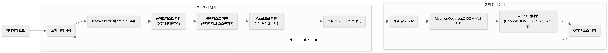

# 완독이 (Wandok)

<div align="center">
  

  <p>웹 문서를 집중해서 읽기 위한 Chrome 확장 프로그램</p>

  <a href="https://wandok-client.vercel.app/">랜딩 페이지</a>
</div>

<br>

## 목차

- [프로젝트 소개](#프로젝트-소개)
- [주요 기능](#주요-기능)
  - [포커스 모드](#1-포커스-모드)
  - [문단 분리](#2-문단-분리)
  - [스크롤 진행률 표시](#3-스크롤-진행률-표시)
- [기술 스택](#기술-스택)
  - [왜 Zustand인가?](#왜-zustand인가)
  - [왜 Vite인가?](#왜-vite인가)
  - [왜 Playwright인가?](#왜-playwright인가)
- [설치 방법](#설치-방법)
- [사용 방법](#사용-방법)
- [Challenges](#challenges)
  - [1. 다국어 문장 분리 알고리즘](#1-다국어-문장-분리-알고리즘)
  - [2. 본문 영역 식별하기](#2-본문-영역-식별하기)
  - [효율적인 DOM 순회를 위한 TreeWalker API 사용](#효율적인-dom-순회를-위한-treewalker-api-사용)
  - [SPA에서 동적으로 로드되는 콘텐츠 문제](#spa에서-동적으로-로드되는-콘텐츠에-기능이-수행되지-않는-문제)

---
<br>

# 프로젝트 소개

**완독이**는 긴 글을 읽을 때 집중력을 유지하도록 도와주는 Chrome 확장 프로그램입니다.

블로그나 뉴스 기사를 읽다 보면, 어디까지 읽었는지 잊어버리거나 중간에 집중이 흐트러지는 경험을 누구나 해봤을 것입니다. 완독이는 이러한 문제를 해결하기 위해 세 가지 핵심 기능을 제공합니다.

---
<br>

# 주요 기능

## 1. 포커스 모드

읽고 있는 문단에 마우스를 올리면 해당 문단만 선명하게 보이고, 나머지는 흐려집니다.

<div align="center">
  
</div>

## 2. 문단 분리

긴 문단이 있다면 클릭 한 번으로 원하는 위치에서 문단을 나눌 수 있습니다.

<div align="center">
  
</div>

## 3. 스크롤 진행률 표시

페이지 우측에 현재 읽은 위치를 시각적으로 보여주는 진행률 바가 표시됩니다.

<div align="center">
  
</div>

---
<br>

# 기술 스택

| 분류 | 기술 |
|-----|-----|
| Core | React 19, TypeScript 5.9 |
| Build | Vite 7 |
| Styling | Tailwind CSS 4 |
| State | Zustand 5 |
| Extension | Chrome Manifest V3 |
| Test | Vitest, Playwright |

<br>

## 왜 Zustand인가?

Chrome 확장 프로그램에서는 번들 크기가 중요합니다. 확장 프로그램이 무거우면 브라우저 성능에 영향을 줄 수 있기 때문입니다.

Redux는 강력하지만 보일러플레이트 코드가 많고, 확장 프로그램의 단순한 ON/OFF 상태 관리에는 과한 선택이었습니다. Zustand는 약 1KB의 작은 번들 크기로 필요한 기능을 충분히 제공했습니다.

<br>

## 왜 Vite인가?

확장 프로그램은 Content Script, Background Script, 웹 랜딩 페이지 등 여러 진입점(entry point)을 가집니다. Vite는 `rollupOptions`를 통해 이러한 멀티 엔트리 빌드를 간단하게 설정할 수 있었습니다.

또한 개발 중 코드 변경 시 확장 프로그램을 자동으로 리로드하는 핫 리로드 플러그인(`hot-reload-extension-vite`)과의 연동도 수월했습니다.

<br>

## 왜 Playwright인가?

Chrome 확장 프로그램의 E2E 테스트는 일반 웹앱 테스트와 다릅니다. 확장 프로그램을 브라우저에 로드하고, 실제 웹페이지에서 Content Script가 작동하는지 확인해야 합니다.

Playwright는 `--load-extension` 옵션으로 확장 프로그램을 로드한 상태에서 테스트할 수 있었고, Shadow DOM 내부 요소에 대한 쿼리도 지원하여 확장 프로그램 테스트에 적합했습니다.

---
<br>

# 설치 방법

## Chrome 웹 스토어에서 설치

1. [Chrome 웹 스토어](https://chromewebstore.google.com/detail/jincebchlimomjcnckefhnbjgcfofnlm?utm_source=item-share-cb)에서 "완독이"를 검색합니다.
2. "Chrome에 추가" 버튼을 클릭합니다.

## 개발 환경에서 실행

```bash
# 저장소 클론
git clone https://github.com/your-username/wandok-client.git
cd wandok-client

# 의존성 설치
npm install

# 확장 프로그램 빌드
npm run build:extension

# 웹 개발 서버 실행
npm run dev
```

**확장 프로그램 로드하기:**

1. Chrome에서 `chrome://extensions` 페이지로 이동합니다.
2. 우측 상단의 "개발자 모드"를 활성화합니다.
3. "압축해제된 확장 프로그램을 로드합니다" 버튼을 클릭합니다.
4. `dist-extension` 폴더를 선택합니다.

---
<br>

## 사용 방법

1. 확장 프로그램 아이콘을 클릭하여 **ON/OFF**를 전환합니다.
2. 블로그나 뉴스 기사 페이지에서 본문 위에 마우스를 올립니다.
3. 문단이 강조되고 나머지가 흐려지는 **포커스 모드**가 작동합니다.
4. 긴 문단을 나누고 싶다면 원하는 문장을 **클릭**합니다.

---
<br>


# Challenges

## 1. 다국어 문장 분리 알고리즘

완독이의 핵심 기능은 사용자가 읽고 있는 문장을 강조하고 나머지를 흐리게 처리하는 것입니다. 이를 위해서는 텍스트를 문장 단위로 정확하게 분리해야 했습니다.

처음에는 단순하게 생각했습니다. "마침표(.), 물음표(?), 느낌표(!)가 나오면 문장이 끝나는 거 아닌가?"

간단한 정규식으로 금방 해결될 것 같았습니다.

<br>

### 첫 번째 시도: 정규식

마침표, 물음표, 느낌표 뒤에서 문장을 나누는 정규식을 작성했습니다.

영어 문장에서는 잘 작동하는 것처럼 보였습니다. 하지만 테스트를 진행하면서 문제가 발견되었습니다.

```
입력: "Mr. Kim went to Seoul."
기대: ["Mr. Kim went to Seoul."]
결과: ["Mr.", "Kim went to Seoul."]
```

"Mr."의 마침표가 문장의 끝으로 인식되어 문장이 잘못 분리되었습니다. Mr., Dr., Prof. 같은 호칭뿐만 아니라, St.(Street), Mt.(Mountain) 같은 약어에서도 같은 문제가 발생했습니다.

<br>

### 두 번째 시도: 약어 목록으로 예외 처리

흔히 사용되는 약어 목록을 만들어서 예외 처리를 하기로 했습니다.

약어들 뒤에 오는 마침표는 정규식에 negative lookbehind 패턴을 추가하여, 약어 뒤에 오는 마침표는 분리 기준에서 제외하려 했습니다.

하지만 정규식을 수정할수록 새로운 문제가 생겼습니다. 새로운 약어(e.g., i.e., vs., etc.)가 발견될 때마다 패턴에 추가해야 했고, 정규식은 `/(?<!(Mr|Mrs|Ms|Dr|Prof|Jr|Sr|St|Mt|Inc|Corp|Ltd|e\.g|i\.e|vs|etc))\.\s+/` 같은 형태가 되며 점점 읽기 어려워졌습니다.

또한, 숫자에 포함된 마침표(3.14, 192.168.0.1)나 줄임표(...)까지 고려하면, 정규식만으로는 모든 케이스를 처리하기 어렵다는 결론에 도달했습니다.

<br>

### 세 번째 시도: NLP 라이브러리 검토

정규식의 한계를 느끼고 자연어 처리(NLP) 라이브러리를 검토했습니다.

- **compromise.js**: 영어에 특화되어 있어 한국어 지원 부족
- **natural**: Node.js 환경 전용이라 브라우저에서 사용 불가
- **korean-sentence-splitter**: 한국어 전용이라 영어 문장 처리 불가

한국어와 영어를 모두 지원하면서, 브라우저에서 동작하고, 번들 크기가 작은 라이브러리를 찾기 어려웠습니다.

또한, Chrome 확장 프로그램은 용량 제한이 있어서 무거운 NLP 라이브러리를 포함하기 부담스러웠습니다.

<br>

### Intl.Segmenter API를 사용해보자

다른 방법을 찾던 중, 브라우저에 내장된 `Intl.Segmenter` API를 발견했습니다.

테스트 결과 별도의 라이브러리 설치 없이 브라우저 내장 기능만으로 문장 분리가 가능했고, 다국어를 지원하여 한국어와 영어가 섞인 텍스트도 처리할 수 있었습니다.

하지만 테스트 코드 실행 결과, 여전히 영어 약어를 제대로 분리하지 못했습니다.

```
입력: "Mr. Kim went to Seoul."
결과: ["Mr.", "Kim went to Seoul."]
```

<br>

### 최종 해결법: 전처리 + API + 후처리 파이프라인

두 가지 접근법을 조합하기로 했습니다. 약어의 마침표를 임시로 다른 문자로 바꿔두고, `Intl.Segmenter`로 문장을 분리한 다음, 다시 마침표로 복원하는 방식입니다.

<br>

**1단계: 약어 뒤의 마침표를 placeholder로 치환하기**

약어 목록을 정의하고, 해당 약어 뒤의 마침표를 특수 문자(placeholder)로 치환합니다.

```
Mr. Kim → Mr[PLACEHOLDER] Kim
Dr. Lee → Dr[PLACEHOLDER] Lee
```

이렇게 하면 `Intl.Segmenter`가 이 마침표를 문장의 끝으로 인식하지 않습니다.

<br>

**2단계: 문장 분리**

`Intl.Segmenter`를 사용하여 문장을 분리합니다. 한국어와 영어를 모두 지원하도록 로케일을 설정했습니다.

<br>

**3단계: placeholder 복원하기**

분리된 각 문장에서 placeholder를 다시 마침표로 복원합니다.

```
Mr[PLACEHOLDER] Kim went to Seoul. → Mr. Kim went to Seoul.
```

<br>

최종적으로 외부 라이브러리 없이 브라우저 내장 API만으로 다국어 문장 분리 문제를 해결할 수 있었습니다. 🥳

---
<br>

## 2. 본문 영역 식별하기

문장 분리 알고리즘이 완성된 후, 다음 과제는 "웹페이지에서 어떤 텍스트를 처리할 것인가"였습니다.

처음에는 단순하게 페이지의 모든 텍스트를 처리하려 했습니다. 하지만 실제 웹사이트에서 테스트했을 때, 버튼 클릭 시 문단 분리 코드가 적용되어 버튼이 복제되는 현상 발생이 발생했습니다.

버튼 외에도 네비게이션, 하이퍼링크 등 불필요한 요소까지 전부 블러 처리 및 문단 분리 기능이 적용되어,
예상치 못한 에러가 발생하거나 오히려 블러 기능이 사용자로부터 불편함을 느끼게 하는 상황이 발생했습니다.

이 문제를 해결하기 위해, 완독이가 꼭 필요한 요소에만 기능이 적용되도록 기획을 변경하였습니다.

<br>

### 첫 번째 시도: 블랙리스트 방식

`<header>`, `<footer>`, `<nav>`, `<button>`, `<a>` 등 처리하지 말아야 할 요소들을 배열 형태로 저장한 뒤, 이 배열 안에 있는 텍스트는 처리하지 않도록 했습니다.

그러나 이런 방법을 적용했을 때, `<a>` 태그 안의 내용도 함께 블러 처리가 되는 문제가 발생했습니다.

```
원본: "자세한 내용은 이 글을 참고하세요."
결과: "자세한 내용은 [  ]을 참고하세요."
```

<br>

### 두 번째 시도: 화이트리스트 방식

이번에는 블랙리스트 방식과는 반대로, "처리할 영역"을 명시적으로 지정해보기로 했습니다.

`<article>`, `<main>` 등 본문 영역에서 사용되는 태그 속 텍스트만 처리하도록 했고, 네비게이션이나 푸터 같은 불필요한 영역은 자동으로 제외할 수 있었습니다.

하지만 새로운 문제가 나타났습니다. 블로그 플랫폼마다 본문 영역을 감싸는 태그나 클래스명이 달랐습니다.

|사이트명|태그, 클래스명|
|---|---|
|일반 웹사이트|`<article>`, `<main>`|
|Brunch|`.wrap_body`|
|Velog|`.atom-one`|
|Medium|`.postArticle-content`|

모든 플랫폼을 지원하려면 각 플랫폼의 HTML 구조를 분석하고 선택자를 추가해야 했습니다.

<br>

### 세 번째 시도: 화이트리스트 + 블랙리스트 조합

두 방식을 조합하기로 했습니다.

<br>

**1단계: 화이트리스트로 본문 영역 확인**

먼저 요소가 본문 영역(`article`, `main`, `.wrap_body` 등) 안에 있는지 확인합니다. 본문 영역 밖의 텍스트는 처리하지 않습니다.

<br>

**2단계: 블랙리스트로 인터랙티브 요소 제외**

본문 영역 안에 있더라도, 버튼이나 입력 필드 같은 인터랙티브 요소는 제외했습니다.

이렇게 하면 본문 안의 일반 링크(`<a>`)는 처리되지만, 클릭 가능한 버튼은 제외할 수 있었습니다.

<br>

## 효율적인 DOM 순회를 위한 TreeWalker API 사용

본문 영역을 식별하는 로직은 완성되었지만, 성능 문제가 남아있었습니다.

웹페이지의 모든 텍스트 노드를 찾으려면 DOM 트리 전체를 순회해야 합니다.

단순한 반복문으로 구현하면 불필요한 요소까지 모두 방문하게 되어 비효율적입니다.

<br>

예를 들어, 1000개의 노드가 있는 페이지가 있을 때,

- 본문 텍스트: 100개
- 스크립트, 스타일, 버튼 등: 900개

라면 단순 순회 시 900개의 불필요한 노드를 방문해야 하는 문제가 발생합니다.

<br>

### DOM 순회 방법 비교하기

텍스트 노드만 찾아내기 위한 방법들을 찾아 비교해보았습니다.

<br>

**방법 1: querySelectorAll**

가장 익숙한 방법은 `querySelectorAll`로 요소를 선택하는 것이었습니다. 하지만 이 방법은 텍스트 노드를 직접 선택할 수 없습니다. 
`querySelectorAll('*')`로 모든 요소를 가져온 뒤 각 요소의 텍스트를 확인해야 하는데, 이는 불필요한 요소까지 모두 메모리에 올리는 문제가 있었습니다.

<br>

**방법 2: 재귀 함수로 직접 구현**

`childNodes`를 사용해 재귀적으로 DOM 트리를 순회하는 방법도 있습니다. 그러나 이 방법을 사용했을 때, 모든 노드를 방문하면서 조건을 확인해야 합니다. 제외해야 할 요소(`<script>`, `<style>` 등) 안에 들어가서 자식 노드까지 모두 확인한 뒤에야 "이건 제외 대상이었구나"라고 판단할 수 있게 되어 비효율적이라고 판단했습니다.

```
<script>
  ├─ 텍스트 1 방문 → 부모 확인 → script임 → 제외
  ├─ 텍스트 2 방문 → 부모 확인 → script임 → 제외
  ├─ 텍스트 3 방문 → 부모 확인 → script임 → 제외
  ...
  └─ 텍스트 10 방문 → 부모 확인 → script임 → 제외

```

**방법 3: TreeWalker API**

`TreeWalker`는 브라우저가 제공하는 DOM 순회 전용 API입니다. 핵심 장점은 필터를 제공한다는 것입니다. 순회 도중에 특정 노드를 만나면 그 노드뿐만 아니라 자식 노드까지 통째로 건너뛸 수 있습니다.

```
<script>
  ├─ 텍스트 노드 1 (건너뜀)
  ├─ 텍스트 노드 2 (건너뜀)
  └─ 텍스트 노드 3 (건너뜀)
      → script 태그를 만나는 순간 내부 전체를 건너뜀
```

<br>

### TreeWalker API를 선택한 이유

`TreeWalker`를 선택한 이유는 두 가지였습니다.

첫째, 텍스트 노드만 순회할 수 있습니다. `NodeFilter.SHOW_TEXT` 옵션을 사용하면 `<div>`, `<p>` 같은 요소 노드는 아예 방문하지 않고 텍스트 노드만 찾아갑니다.

둘째, `FILTER_REJECT` 옵션으로 특정 요소와 그 자식들을 통째로 건너뛸 수 있습니다. `<script>` 태그를 만나면 그 안의 코드 텍스트를 하나하나 확인하지 않고 바로 다음으로 넘어갑니다.

<br>

### TreeWalker API 사용하기

`TreeWalker`의 필터는 각 노드를 방문할 때마다 호출되어 세 가지 중 하나를 반환합니다.

- `FILTER_ACCEPT`: 이 노드를 결과에 포함
- `FILTER_SKIP`: 이 노드는 건너뛰되, 자식은 확인
- `FILTER_REJECT`: 이 노드와 모든 자식을 건너뜀

이 속성을 이용해, 필요한 요소만 탐색하여 텍스트 노드를 추출하는 방법을 사용했습니다.

<br>

**1. 제외 태그 내부는 전부 탐색하지 않았습니다.**

`<script>`, `<style>`, `<button>`, `<input>` 등의 태그 안에 있는 텍스트는 본문이 아닙니다. 이런 태그를 만나면 `FILTER_REJECT`를 반환하여 내부를 탐색하지 않습니다.

<br>

**2. 공백만 있는 노드는 탐색하지 않았습니다.**

```html
<div>
  <p>안녕하세요</p>    ← div와 p 사이의 공백도 텍스트 노드
</div>
```

HTML에는 들여쓰기나 줄바꿈으로 인한 공백 텍스트 노드가 많습니다. 이런 노드는 의미 있는 텍스트가 아니므로 `FILTER_REJECT`로 건너뜁니다.

<br>

**3. 이미 처리된 요소는 건너뛰었습니다.**

`wandok-text-wrapper` 클래스가 있는 요소는 이미 처리된 텍스트입니다. 다시 처리하면 `<span>` 태그가 중첩되므로 건너뜁니다.

<br>

## SPA에서 동적으로 로드되는 콘텐츠에 기능이 수행되지 않는 문제

정적인 웹페이지에서는 잘 작동했지만, Velog, Medium 같이 SPA(Single Page Application)로 만들어진 경우, 완독이의 기능이 제대로 수행되지 않는 경우가 있었습니다.

<br>

**문제 상황 1: 무한 스크롤**

Velog나 Medium 같은 플랫폼에서는 스크롤하면 새로운 글이 계속 로드됩니다. 초기 로드 시에만 텍스트를 처리하면, 나중에 추가된 글에는 포커스 모드가 작동하지 않았습니다.

<br>

**문제 상황 2: SPA 라우팅**

React나 Vue로 만든 SPA에서는 페이지 이동 시 전체 페이지가 새로고침되지 않고 콘텐츠만 바뀝니다. 초기 로드 시 처리한 텍스트가 사라지고 새로운 텍스트가 나타나도, 확장 프로그램은 이를 감지하지 못했습니다.

<br>

### MutationObserver로 DOM 변화 감지하기

`MutationObserver` API를 사용하여 DOM의 변화를 실시간으로 감지했습니다. 새로운 요소가 추가되면 자동으로 텍스트 처리를 수행하도록 했습니다.

#### MutationObserver가 작동하면서 같은 텍스트가 여러 번 처리되는 문제

```
1회 처리: 안녕하세요 → <span>안녕하세요</span>
2회 처리: <span><span>안녕하세요</span></span>  ← 태그 중첩!
```

`<span>` 태그가 중첩되면서 레이아웃이 망가졌습니다.

**해결: WeakSet으로 처리 이력 관리**

이미 처리한 텍스트 노드를 `WeakSet`에 저장하고, 처리 전에 확인하도록 했습니다.

`WeakSet`을 선택한 이유는 메모리 관리 때문입니다. 일반 `Set`을 사용하면 DOM에서 제거된 요소도 목록에 계속 남아있어 메모리 누수가 발생합니다. `WeakSet`은 저장된 요소가 DOM에서 제거되면 자동으로 가비지 컬렉션의 대상이 되어 메모리가 해제됩니다.



위와 같은 구조로 다양한 웹사이트에서 본문 텍스트만 정확하게 식별하여 처리할 수 있게 되었습니다.
